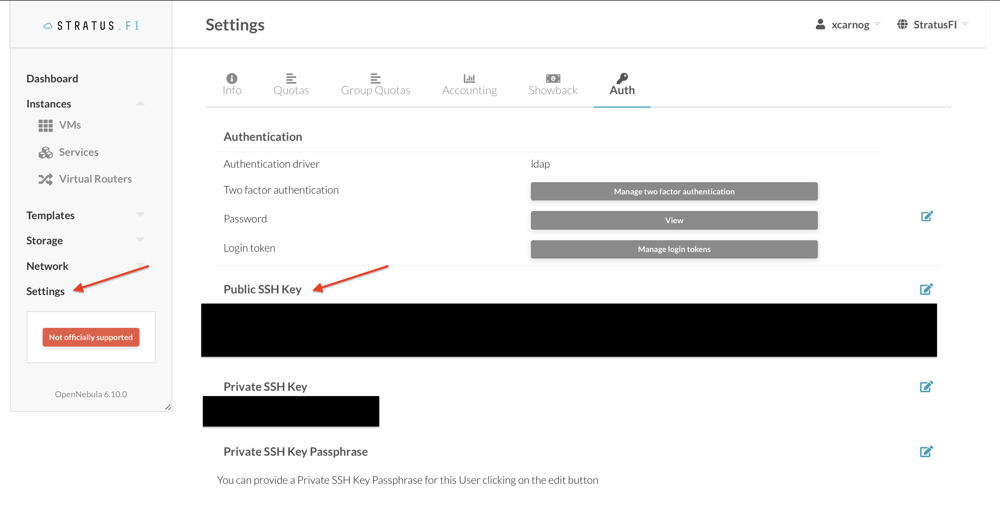
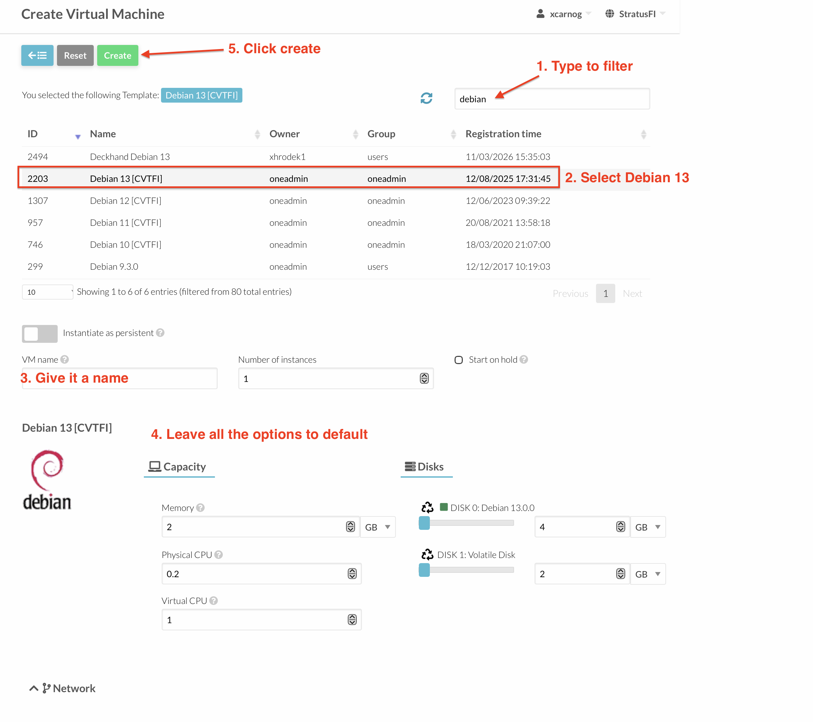
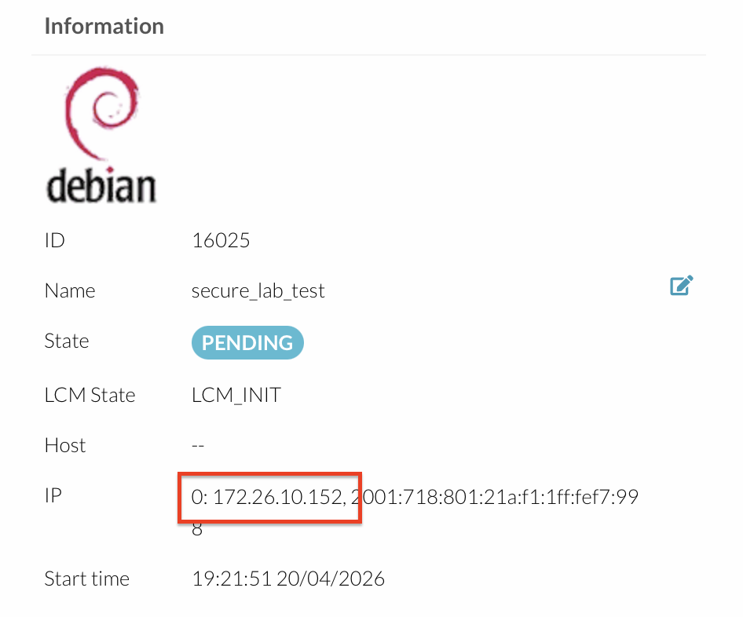
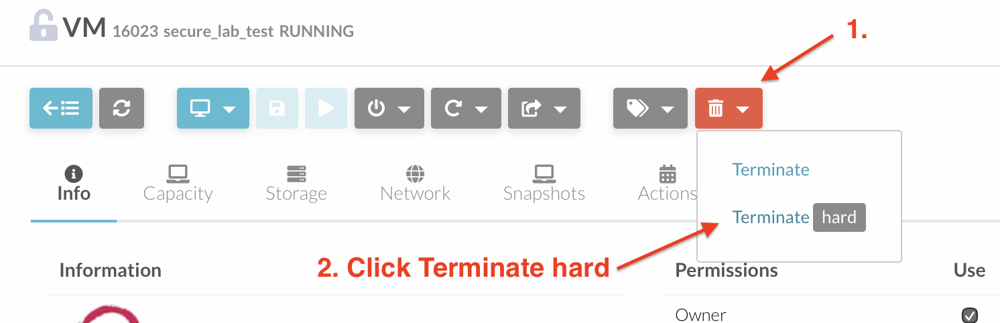
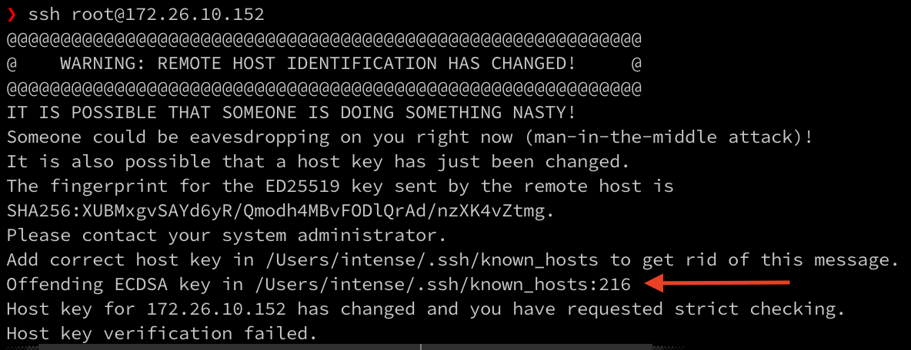

Secure Coding Lab exercise
==========================

**IMPORTANT: always check for the latest version prior to the lab/seminar. Changes may occur**

NOTICE: this repository also contains malware samples, it is possible your AV software may show alerts


Instructions & prerequisites:
-----------------------------

- Access to Stratus (stratus.fi.muni.cz)
  - make sure to configure your SSH key under Settings -> Auth -> Public SSH Key




Installation:
---

Create a Debian13 VM machine with the default options:




Connect to your machine via SSH as root:
```ssh root@<IP>```

You can find the ip at the vm details page



When the VM boots up, login via ssh and run the following command:

```shell
curl "https://raw.githubusercontent.com/SourceCode-AI/secure_coding/refs/heads/master/install_debian.sh"|bash
```

FAQ
===

How do I remove the lab machine?
---



How do I generate the SSH key?
---

On Linux/Mac, run the following commands:
```
bash$ ssh-keygen -t ed25519
Generating public/private ed25519 key pair.
Enter file in which to save the key (/Users/user/.ssh/id_ed25519)

```

Public key would be saved under `/Users/user/.ssh/id_ed25519.pub`


How do I convert multiline key to one liner?
---


`ssh-keygen -i -f /tmp/input_key` OR `puttygen -O public-openssh tmp/Public-Key`


I get this error
----


This means you may have recreate the machine in a short amount of time or the ip was recycled to which you previously connected. You must go to the file path at the highlighted location and remove the host identification lines for that ip address from your known_hosts file. After removing these lines from the file, you should be able to log in back