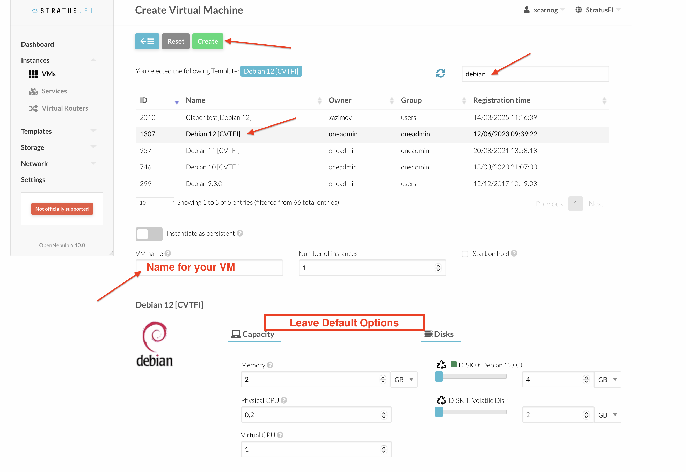

Secure Coding Lab exercise
==========================

**IMPORTANT: always check for the latest version prior to the lab/seminar. Changes may occur**

NOTICE: this repository also contains malware samples, it is possible your AV software may show alerts


Instructions & prerequisites:
-----------------------------

- Access to Stratus (stratus.fi.muni.cz)
  - make sure to configure your SSH key under Settings -> Auth -> Public SSH Key


Installation:
---

Create a Debian12 VM machine with the default options:




When the VM boots up, login via ssh and run the following command:

```shell
curl "https://raw.githubusercontent.com/SourceCode-AI/secure_coding/refs/heads/master/install_debian.sh"|bash
```
